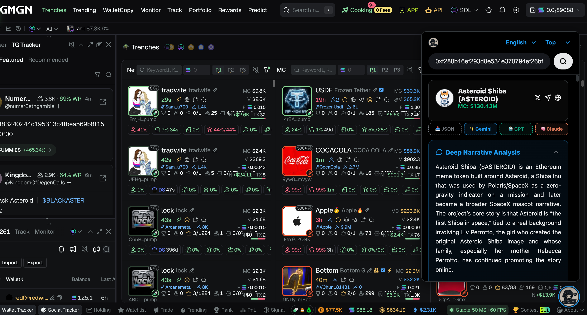
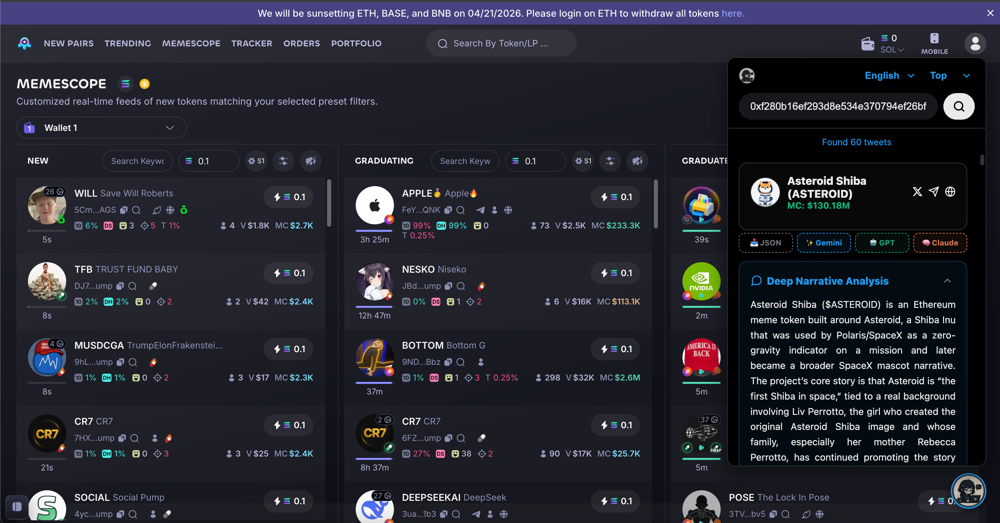
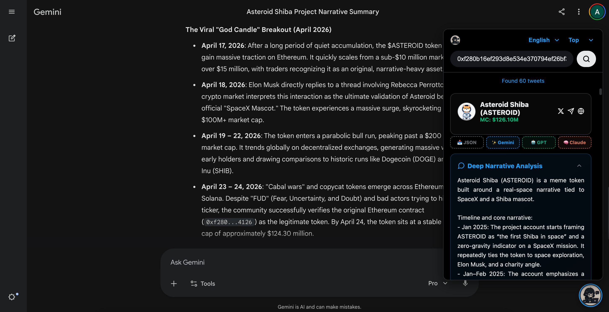

# XScope - The Ultimate Twitter & Crypto Intelligence Extension

xscope is a powerful browser extension that injects AI-driven narrative intelligence directly into your favorite trading terminals. Discover real-time X sentiment, developer updates, and token narratives without ever leaving your charts.

XScope performs secure, real-time searches by utilizing your active X session cookies. Please ensure you are logged into your X account in this browser to enable all features.

## 🚀 Key Features

- **Social & Narrative Intelligence**: Instant summaries of project narratives, KOL deep-dives, and relationship tracking via X v1.1 API.
- **AI Integration**: One-click context injection into Gemini/ChatGPT/Claude and support for custom OpenAI-compatible endpoints.
- **Trading Workflow**: Native UI injection and real-time Dexscreener insights on platforms like GMGN, BullX, Axiom, and Photon.
- **Premium UX**: Modern Chrome Side Panel UI, parallel multi-tasking, and full i18n support (EN/CN/ES/DE/JA/KO).

## 🛠 Tech Stack

- **Framework**: Chrome Extension MV3 (Vanilla HTML/CSS/JS).
- **Data Sources**: X GraphQL/REST v1.1, Dexscreener API.
- **Intelligence**: OpenAI-compatible API integration.

## 📺 Visual Previews

### Native Terminal Integration
XScope seamlessly injects AI-driven narrative intelligence directly into your favorite trading dashboards.

| GMGN.ai Integration | Photon Integration |
| :---: | :---: |
|  |  |

### Advanced Narrative Intelligence
While the built-in system uses efficient models, you can export structured data to unthrottled web-based versions like **Gemini 3.1 Pro** for deeper reasoning.

| Gemini Enhanced Analysis |
| :---: |
|  |

## 📦 Installation

1. Clone or download this repository.
2. Open Chrome and navigate to `chrome://extensions/`.
3. Enable **Developer mode** (top right).
4. Click **Load unpacked** and select the directory.

## ⚙️ Configuration & Tips

XScope is designed to be flexible. You can access the **Global Settings** by clicking the **Gear icon** inside the popup, or simply **click the XScope LOGO** in the top-left corner for instant access.

- **Max Fetch Count**: Adjust how many tweets to fetch per search (default: 50, recommended ≤ 100 for stability).
- **AI Customization**: Bind your own **API Key** and customize the **System Prompt** to tailor the narrative analysis to your specific trading strategies.
- **Floating Button**: Toggle the visibility of the on-page floating analysis button.

## 🛡️ Technical Requirement & Privacy

- **Safe Search**: XScope performs scans by utilizing your **active browser session cookies** on X.com. This ensures high-speed, secure data fetching without requiring your password.
- **Login Required**: You MUST be logged into your account on **X.com** in this browser to enable search functionality.
- **Cross-Platform**: Supported sites include GMGN, BullX, Axiom, xxyy, Binance Web3, OKX Web3, Photon, ChatGPT, Claude, and Gemini.

---
*XScope: Empowering the next generation of crypto-native intelligence.*
